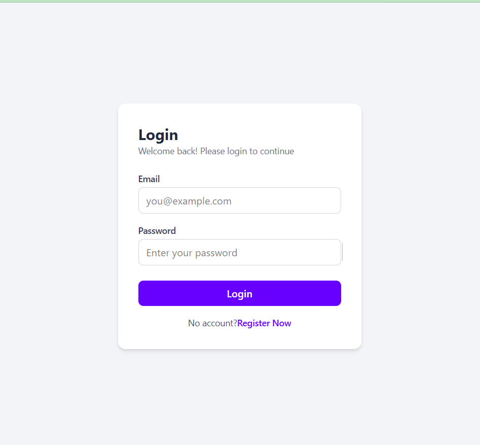
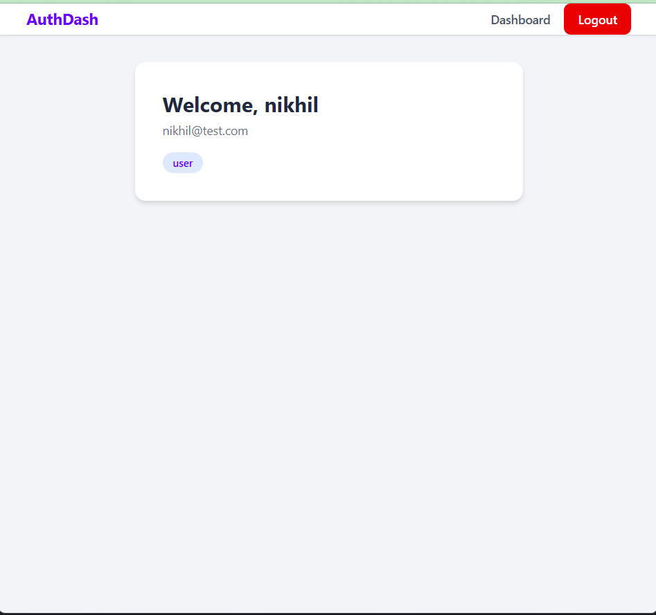
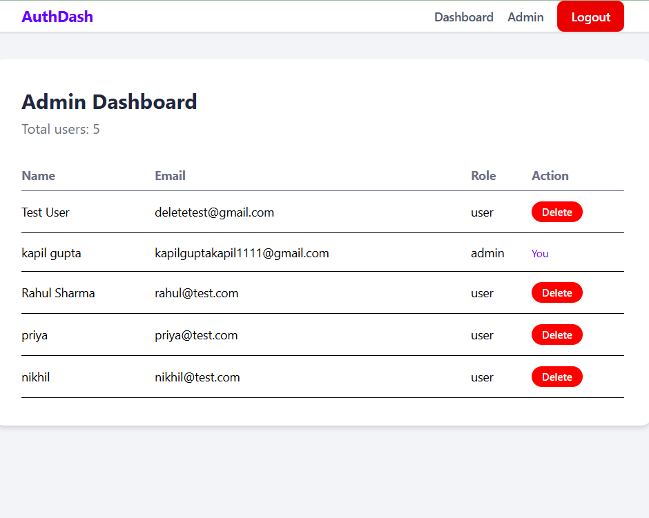

# Auth + Role-Based Dashboard

This is my first full-stack project. I wanted to learn how login, JWT and admin roles actually work, so I built it step by step and deployed it.

Users can register, log in and see their dashboard. Admins also get an admin panel where they can see all users and delete them.

**Live app:** https://auth-role-dashboard.vercel.app
**Backend API:** https://auth-role-dashboard.onrender.com

Note: the backend is on Render's free plan, so the first request can take 30-60 seconds to wake up.

## Screenshots

| Login | User Dashboard | Admin Panel |
|---|---|---|
|  |  |  |

## Features

- Register and login
- Passwords are hashed with bcrypt (not saved as plain text)
- JWT token after login (valid for 7 days)
- User dashboard with name, email and role
- Admin panel with all users in a table
- Admin can delete users (it asks for confirmation first)
- Admin can't delete his own account (checked on both frontend and backend)
- Protected pages: without login you go back to /login, and normal users can't open /admin
- Backend checks the token and the role from the database on every protected route
- Validation for empty fields, wrong data types, short passwords and invalid MongoDB ids
- Email is trimmed and lowercased, so one email can't make two accounts

## Tech stack

- **Frontend:** React (Vite), React Router, Tailwind CSS
- **Backend:** Node.js, Express, JWT, bcryptjs
- **Database:** MongoDB Atlas with Mongoose
- **Deployed on:** Vercel (frontend) and Render (backend)

## How login works

1. User enters email and password, and React sends them to the backend
2. Backend checks the password with bcrypt and sends back a JWT token
3. React saves the token in localStorage and opens the dashboard (or the admin panel for admins)
4. For protected APIs, React sends the token in the `Authorization: Bearer <token>` header
5. Backend middleware checks the token and the role, then sends the data

## API routes

| Method | Route | Who can use it |
|---|---|---|
| POST | /api/auth/register | Anyone |
| POST | /api/auth/login | Anyone |
| GET | /api/auth/profile | Logged-in user |
| GET | /api/auth/admin | Admin |
| GET | /api/auth/users | Admin |
| DELETE | /api/auth/users/:id | Admin |

## Folder structure

```
auth-role-dashboard/
├── server/   Express API (routes, controllers, middleware, models)
└── client/   React app (pages, components)
```

## Run it locally

**Backend**

```
cd server
npm install
```

Create `server/.env`:

```
PORT=5000
MONGO_URI=your_mongodb_connection_string
JWT_SECRET=your_secret_key
```

```
npm start
```

**Frontend** (in a new terminal)

```
cd client
npm install
```

Create `client/.env`:

```
VITE_API_URL=http://localhost:5000
```

```
npm run dev
```

## Problems I faced

**Backend**
- My ISP's DNS couldn't resolve the `mongodb+srv://` connection string, so I used the normal `mongodb://` format instead
- I forgot `await` before `findOne` once. I got a Promise instead of the user, so the "user already exists" check never worked
- `minlength: 6` in the schema didn't work for passwords, because it was checking the hashed password (always 60 characters). I moved the check to the controller

**Frontend**
- After deploying, refreshing `/dashboard` gave a 404, because a single page app only has `index.html`. I fixed it with a rewrite in `vercel.json`
- The backend URL was hardcoded as `localhost` in four places, which breaks after deploying. I moved it to a `VITE_API_URL` environment variable
- With a wrong token, the admin page crashed (`users.map is not a function`) because the error was saved as the user list. Now it checks `res.ok` first
- A missing `/` in `<Navigate to="login">` sent users to `/admin/login` instead of `/login`

## What I learned

- Frontend checks are only for user experience. The real security has to be in the backend, because anyone can call the API directly from Postman.
- Something that works on localhost can still break after deploying (refresh 404, localhost URL), so I need to test the live version properly.
- Reading the error carefully (401 vs 404 vs "Failed to fetch") tells me where the problem is much faster than guessing.

## What I want to add next

- Change a user's role from the admin panel
- Loading spinners while waiting for the API
- httpOnly cookies or refresh tokens instead of keeping the token in localStorage

## Status

Done and deployed ✅